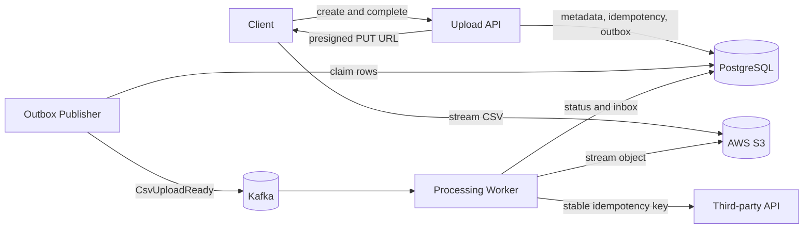
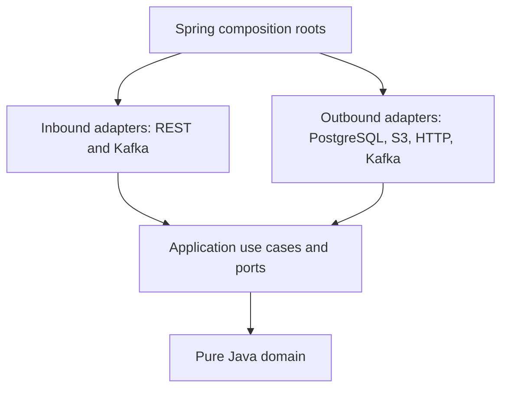
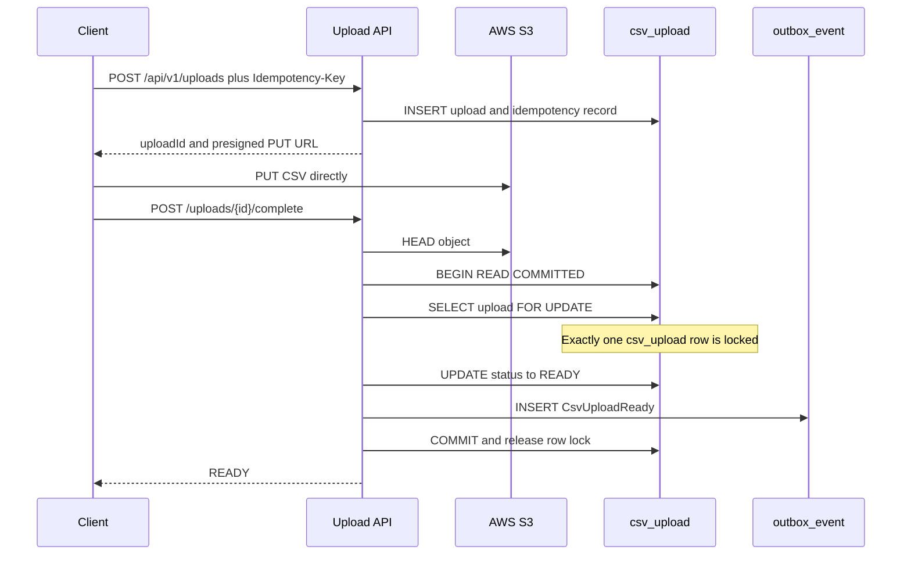
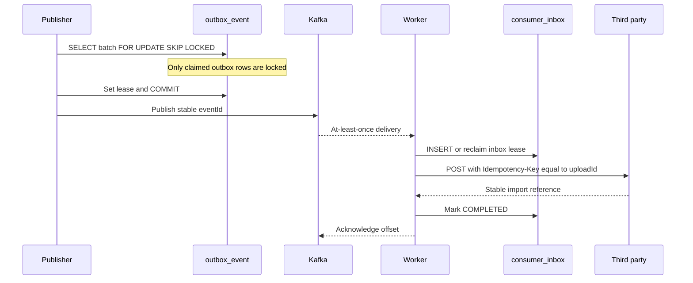
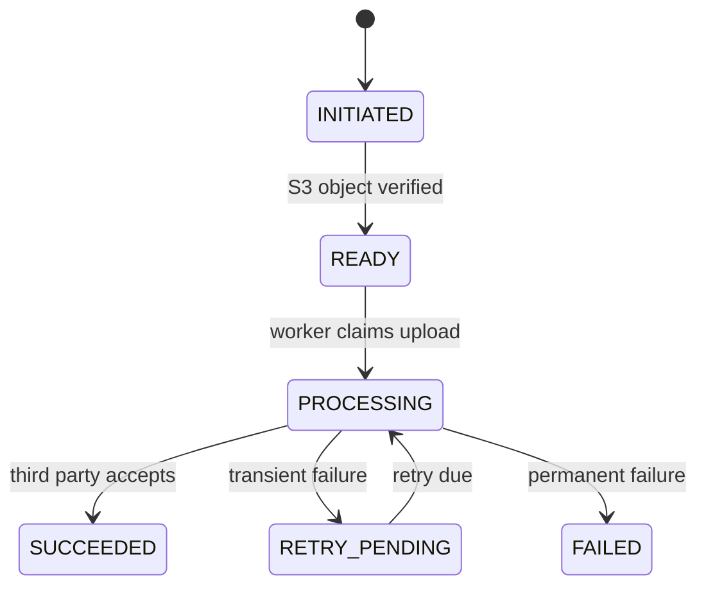

# CSV Processing Pipeline

A Spring Boot reference project for reliable, asynchronous CSV imports. Clients upload directly to AWS S3; the API records metadata and an outbox event atomically; Kafka wakes a worker that streams, validates, and submits the file to an idempotent third-party service.

## Architecture



The dependency rule is enforced by ArchUnit:



Domain and application code contain no Spring, JDBC, Kafka, HTTP, or AWS imports. Framework code stays in adapters and application composition roots.

## Upload flow



The S3 `HEAD` call happens before the database transaction, so a slow network call never extends the row lock. Repeated completion locks the same row, observes `READY`, and returns without creating a second event. A unique outbox business key provides a second line of defense.

## Outbox and worker flow



Publishing can duplicate an event if the publisher crashes after Kafka accepts it but before `published_at` is saved. The worker inbox deduplicates the stable event ID, and the third party deduplicates the stable upload ID. This gives effectively-once business processing without a distributed transaction.

## State machine



## Database consistency

- Isolation level: PostgreSQL `READ COMMITTED`.
- Completion locks one `csv_upload` row with `SELECT ... FOR UPDATE`.
- Publishers claim different batches with `FOR UPDATE SKIP LOCKED`.
- HTTP idempotency is unique on `(operation, idempotency_key)` and stores a normalized request hash.
- Inbox deduplication is unique on `(consumer_name, event_id)`.
- No transaction remains open during S3, Kafka, CSV parsing, or third-party network calls.
- Partial indexes support unpublished outbox polling and due retries; no speculative indexes are included.

## Modules

```text
applications/upload-api           REST API and outbox scheduler
applications/processing-worker    Kafka consumer and CSV processor
applications/third-party-stub     Idempotent local demonstration service
modules/upload-domain             State and business invariants
modules/upload-application        Use cases and technology-neutral ports
modules/upload-adapters           PostgreSQL and AWS S3 adapters
docs/adr                          Architecture decisions
```

## API example

```http
POST /api/v1/uploads
Idempotency-Key: upload-demo-001
Content-Type: application/json

{
  "fileName": "people.csv",
  "contentType": "text/csv",
  "sizeBytes": 42,
  "sha256": "0123456789abcdef0123456789abcdef0123456789abcdef0123456789abcdef"
}
```

Upload the file to the returned `uploadUrl` using every `requiredHeaders` entry, then call:

```http
POST /api/v1/uploads/{uploadId}/complete
GET  /api/v1/uploads/{uploadId}
```

## Running locally

Requirements: Java 21, Docker, and an AWS S3 bucket. Export `AWS_ACCESS_KEY_ID`, `AWS_SECRET_ACCESS_KEY`, `AWS_REGION`, and `S3_BUCKET`, then run:

```bash
docker compose up --build
```

Services use ports `8080` (API), `8082` (third-party stub), `5432` (PostgreSQL), and `9092` (Kafka). Presigned URLs ensure file bytes bypass the API.

## Tests

```bash
./mvnw clean verify
```

Unit tests cover state transitions, retry timing, and idempotent orchestration. ArchUnit enforces clean boundaries. The schema and SQL expose the exact constraints, locks, leases, and indexes used for concurrency control.

## Failure scenarios to discuss in an interview

| Failure window | Recovery |
|---|---|
| API stops before transaction commit | Neither READY nor the outbox event exists; completion can be retried. |
| API stops after commit | Outbox publisher still discovers the event. |
| Publisher stops after Kafka acknowledgment | Event may be published again; inbox deduplicates it. |
| Worker stops before partner response | Inbox lease expires and another worker retries. |
| Partner accepts but response times out | Retry uses the same upload ID and receives the original result. |
| Kafka redelivers | Completed inbox record acknowledges without another import. |
| Invalid CSV | Upload becomes FAILED with a stable failure code. |

Caching and read replicas are deferred because this workflow is dominated by consistency-sensitive writes and point reads. They can be added for high-volume status queries after measuring load, with replica lag explicitly reflected in the API contract.
