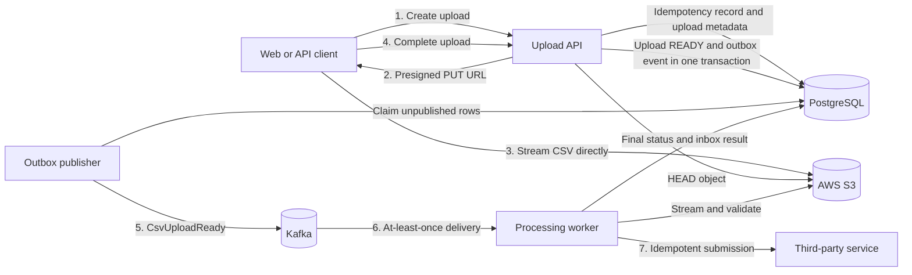
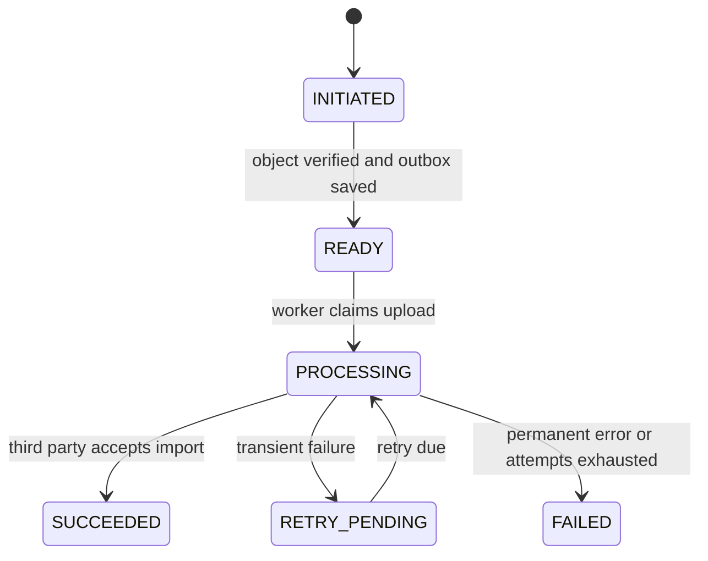
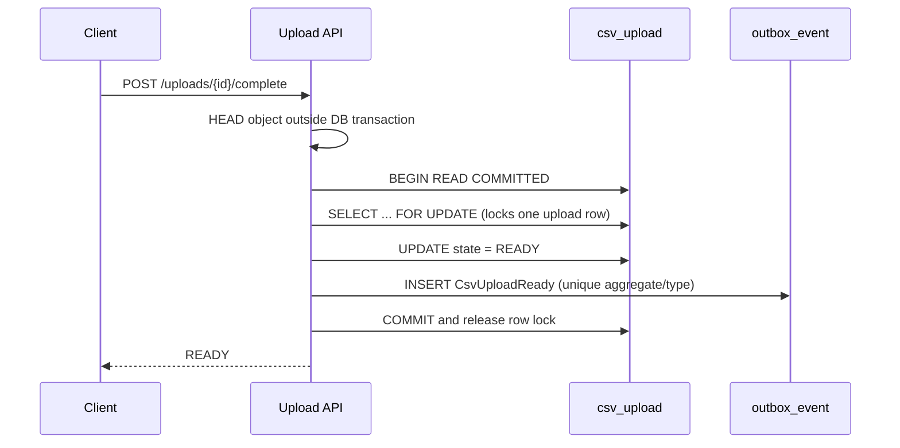
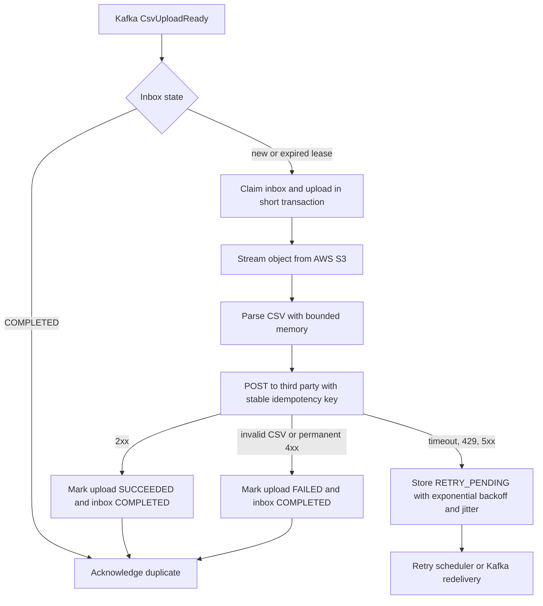

# CSV Processing Pipeline — Design Specification

## Purpose

Build an interview-ready Spring Boot system that accepts large CSV uploads, stores them outside the database, and sends their contents to a third-party service asynchronously. The project demonstrates clean architecture, transactional consistency, idempotency, concurrency control, Kafka delivery, failure recovery, and operational visibility without adding unrelated infrastructure.

## Scope

The first release will:

- create an upload request through a REST API using an `Idempotency-Key` header;
- return a presigned AWS S3 URL so the client uploads the CSV directly to S3;
- verify and finalize the uploaded object;
- atomically change upload state and write an outbox event;
- publish the outbox event to Kafka;
- consume the event, stream and validate the CSV, and submit it to a simulated third-party service;
- tolerate duplicate HTTP requests, duplicate Kafka delivery, publisher crashes, consumer crashes, and transient third-party failures;
- expose health, readiness, metrics, and structured logs;
- run locally with Docker Compose and use integration tests against PostgreSQL, Kafka, and an isolated LocalStack S3 test environment.

The first release will not add Redis, a read replica, Kubernetes, authentication, or a browser UI. Caching and replicas do not improve correctness in this write-oriented workflow and would obscure the consistency mechanisms being demonstrated.

## Technology Baseline

- Java 21
- Spring Boot 4.1.1
- Maven Wrapper
- Spring MVC and Bean Validation
- Spring JDBC for explicit SQL and transaction boundaries
- PostgreSQL 17
- Spring for Apache Kafka
- AWS S3 through AWS SDK for Java 2.x
- Flyway migrations
- Testcontainers, JUnit 5, AssertJ, Awaitility, and WireMock
- Docker Compose for the runnable local stack

Spring JDBC is preferred to JPA for this project because the important database behavior—`FOR UPDATE`, deterministic state transitions, and `FOR UPDATE SKIP LOCKED` leasing—should be visible in the code and SQL.

## Repository and Module Structure

The repository will be named `csv-processing-pipeline-spring` and use a single Maven build with three independently runnable Spring Boot applications and shared clean-architecture modules:

```text
csv-processing-pipeline-spring/
├── pom.xml
├── applications/
│   ├── upload-api/              # REST inbound adapter and API composition root
│   ├── processing-worker/       # Kafka inbound adapter and worker composition root
│   └── third-party-stub/        # Idempotent local dependency for demos/tests
├── modules/
│   ├── upload-domain/           # Java-only entities, value objects, state rules
│   ├── upload-application/      # Use cases and inbound/outbound ports
│   └── upload-adapters/         # PostgreSQL, AWS S3, Kafka, HTTP implementations
├── docs/
│   ├── adr/
│   └── superpowers/
├── compose.yaml
└── README.md
```

`upload-domain` and `upload-application` contain no Spring, JDBC, Kafka, HTTP, or S3 imports. Applications assemble ports and adapters using explicit Spring configuration. ArchUnit tests enforce these dependency rules.

## System Architecture



## HTTP API

### Create an upload

`POST /api/v1/uploads`

Headers:

```http
Idempotency-Key: upload-2026-09-23-001
Content-Type: application/json
```

Body:

```json
{
  "fileName": "contractors.csv",
  "contentType": "text/csv",
  "sizeBytes": 18432,
  "sha256": "lowercase-hex-sha256"
}
```

The transaction stores a hash of the normalized request and the resulting upload ID. Reusing the key with the same request returns the original response; reusing it with a different request returns `409 Conflict`.

The response contains the upload ID, `INITIATED` status, an expiring presigned PUT URL, required object headers, and expiry time.

### Complete an upload

`POST /api/v1/uploads/{uploadId}/complete`

The API uses object-storage `HEAD` to verify existence, size, content type, and checksum metadata. It then locks the upload row, performs an idempotent state transition to `READY`, and inserts `CsvUploadReady` in the outbox within the same PostgreSQL transaction. Repeating completion returns the existing state and never creates a second logical event.

### Read an upload

`GET /api/v1/uploads/{uploadId}` returns status, failure code, timestamps, and third-party reference when available. It never returns a storage credential or raw object key to another tenant.

## Domain Model and State Machine



`Upload` owns the legal transitions. Adapters may persist state but cannot invent transitions.

Primary tables:

- `csv_upload`: identity, expected object metadata, state, processing lease, attempt count, failure details, and third-party reference;
- `http_idempotency`: unique `(operation, idempotency_key)`, request hash, resource ID, response snapshot, and expiry;
- `outbox_event`: event identity, aggregate identity, type, versioned JSON payload, attempt count, availability time, lease, publication time, and last error;
- `consumer_inbox`: unique `(consumer_name, event_id)`, processing state, attempt count, lease, and completion time;
- `third_party_request`: used only by the stub, with a unique request ID and stable response.

## Transaction Boundaries, Locks, and Isolation

PostgreSQL uses `READ COMMITTED`, which is sufficient because correctness comes from uniqueness constraints, conditional writes, and explicit row locks rather than repeatable reads.



The worker also holds the upload row lock only during short claim and finalize transactions. It never holds a database transaction or row lock while downloading a file, parsing CSV, calling Kafka, or waiting for the third party.

The outbox publisher claims a bounded batch with `FOR UPDATE SKIP LOCKED`, records a lease, and commits before publishing. Multiple publisher threads or instances can run concurrently without claiming the same row. If a process dies, the lease expires and another instance retries.

## Delivery and Idempotency Guarantees

The system provides effectively-once business processing over at-least-once delivery:

1. The upload state and outbox event commit atomically.
2. Publishing can produce duplicates if the process crashes after the Kafka acknowledgment but before recording `published_at`.
3. Kafka events carry a stable `eventId`, `uploadId`, schema version, correlation ID, occurrence time, and trace context.
4. The worker inbox uniquely identifies `(consumer_name, event_id)` and uses a recoverable lease instead of treating an unfinished inbox row as complete.
5. Every third-party submission uses a stable idempotency key derived from the upload ID. Retrying after an ambiguous timeout returns the original third-party result.
6. Kafka offsets are acknowledged only after processing reaches a durable terminal or retry state.

No distributed transaction spans PostgreSQL, Kafka, object storage, and the third party.

## Worker Flow and Failure Handling



CSV parsing is streaming and bounded by configurable limits for file size, row count, column count, field length, and processing time. Formula-like cells are treated as plain text because this service does not generate spreadsheets. Error responses use RFC 9457 problem details and avoid leaking object keys or third-party response bodies.

Retries use exponential backoff with jitter and a maximum attempt count. Exhausted technical failures become `FAILED` with a stable failure code. Kafka deserialization failures go to a dead-letter topic with the original event metadata. Operators can inspect metrics and logs, then replay safely because all boundaries are idempotent.

## Concurrency and Multithreading

- The API uses normal request concurrency; database uniqueness and row locking serialize conflicting operations.
- The outbox scheduler uses a bounded executor and database leases. Batch size and concurrency are configurable.
- Kafka listener concurrency is configurable and partition-aware.
- Blocking object-storage and HTTP work runs on bounded platform-thread pools. Java 21 virtual threads are deliberately excluded from the first release so thread-pool limits and backpressure remain explicit and observable.
- Per-upload work is never processed concurrently after lease acquisition, while different uploads can progress in parallel.

## Database Constraints and Indexes

Required constraints and indexes include:

- unique `http_idempotency(operation, idempotency_key)`;
- unique outbox business key for one ready event per upload;
- unique `consumer_inbox(consumer_name, event_id)`;
- unique stub `third_party_request(idempotency_key)`;
- partial outbox polling index on `(available_at, created_at)` where `published_at IS NULL`;
- worker scheduling index on `(state, next_attempt_at)` for retryable states;
- index on `csv_upload(created_at DESC)` for operational lookup.

Every index supports a documented query. No speculative indexes are added.

## Observability and Operations

- Spring Boot Actuator health groups distinguish liveness from dependency-aware readiness.
- Micrometer exposes counters and timers for uploads, outbox lag, publish retries, worker duration, third-party outcomes, and terminal failures.
- Structured JSON logs include correlation ID, upload ID, event ID, attempt number, and trace ID; they exclude presigned URLs and CSV data.
- Graceful shutdown stops new claims, waits for bounded in-flight work, and leaves leases recoverable.
- Flyway owns all schema changes; applications validate rather than create schemas.

## Testing Strategy

Unit tests cover domain transitions, request hashing, retry scheduling, and error classification without Spring.

Architecture tests prove domain and application modules do not depend on frameworks or adapters.

Integration tests use PostgreSQL and Kafka through Testcontainers plus LocalStack's isolated S3 test service. LocalStack is test infrastructure only; production code and documentation expose AWS S3 concepts and use the AWS SDK. Tests cover:

- same idempotency key and same payload returns one upload;
- same idempotency key and different payload returns conflict;
- concurrent completion requests create one ready transition and one logical outbox event;
- multiple outbox publishers never claim one row simultaneously;
- publisher crash after Kafka acknowledgment causes a harmless duplicate;
- duplicate Kafka delivery results in one third-party import;
- worker crash or expired lease permits recovery;
- ambiguous third-party timeout retries with the same key;
- invalid CSV fails without partial submission;
- transient failures back off and eventually succeed or exhaust attempts;
- files are streamed rather than loaded fully into heap.

An end-to-end smoke test starts the Compose stack, uploads a sample CSV using the presigned URL, completes it, and waits for `SUCCEEDED`.

## Documentation

The README leads with Mermaid diagrams that render on GitHub and explains every connection, state transition, row lock, isolation level, and failure window. It includes local startup, a curl walkthrough, testing commands, and interview discussion points.

The initial ADRs are:

1. hexagonal boundaries and Maven modules;
2. direct-to-object-storage uploads;
3. transactional outbox instead of dual writes;
4. PostgreSQL `READ COMMITTED` plus explicit locks;
5. effectively-once processing with inbox and third-party idempotency;
6. why caching and read replicas are deferred.

## Acceptance Criteria

- `docker compose up --build` starts PostgreSQL, Kafka, the API, worker, and third-party stub; AWS S3 is configured separately through environment variables.
- The documented upload walkthrough reaches `SUCCEEDED`.
- Concurrent and duplicate requests cannot create duplicate uploads, ready events, or third-party imports.
- A crash at any documented failure window can recover without losing an accepted upload.
- All automated tests and architecture rules pass.
- README Mermaid diagrams render on GitHub.
- The repository contains no unwanted company name, automated attribution, or additional commit author.
- Every commit is authored and committed only as `Ala Ben Abdallah <benabdallahala4@gmail.com>`.
